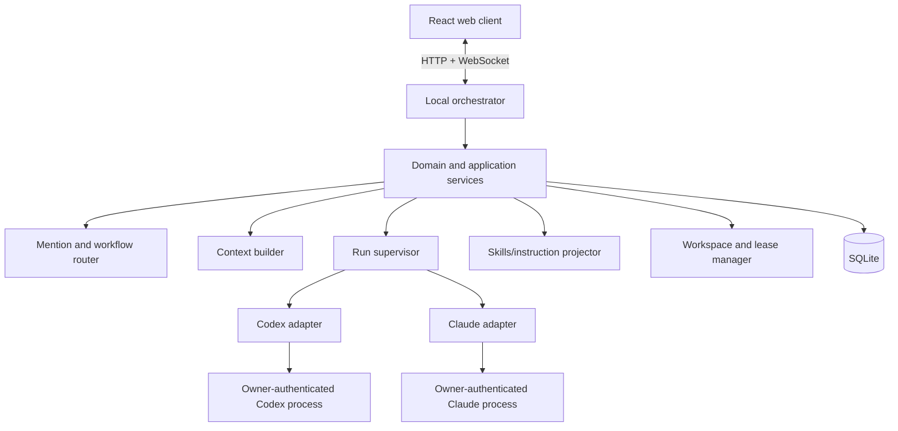

# System architecture

## Architectural style

Use a local modular monolith, not microservices. Development may run separate web and server processes; production runs one local server that serves static frontend assets and owns SQLite and provider child processes.



## Target repository layout

```text
apps/
  server/                 Fastify HTTP/WS composition root
  web/                    React/Vite application
packages/
  contracts/              shared DTOs, schemas, event names
  core/                   domain model and application services
  db/                     SQLite connection, migrations, repositories
  provider-base/          adapter helpers and process supervision
  provider-fake/          deterministic test provider
  provider-codex/         Codex CLI/SDK integration
  provider-claude/        Claude Code CLI Personal Mode integration
  skills/                 canonical skill discovery/projection
  workspace/              path validation, permissions, leases
  test-support/           fixtures and builders
contracts/                planning-time normative specifications
docs/                     design, phases, decisions, handoffs
```

The implementation may refine names in Phase 1, but boundaries and dependency direction are fixed.

## Dependency rule

```text
web -> contracts
server -> contracts + core + db + adapters + skills + workspace
core -> contracts + abstract ports
db -> core ports + contracts
provider-* -> provider-base + contracts
provider-* -X-> web, db, or another provider
```

Provider packages must not import each other. Core does not parse JSONL, spawn processes, know CLI flags, or access credential files.

## Major components

### Web client

Renders rooms, messages, run states, provider health, context inspection, settings, skills, and approvals. It keeps only ephemeral UI state in browser storage. The server remains authoritative.

### HTTP/WebSocket server

- Binds to `127.0.0.1` in Personal Mode.
- Validates every request at the boundary.
- Assigns request IDs and room sequences.
- Serves static production assets.
- Does not execute shell strings from client input.

### Domain/application core

- Creates rooms/messages/runs.
- Resolves mentions to authorized targets.
- Captures a room sequence snapshot for fan-out.
- Enforces run and lease state machines.
- Publishes durable and transient normalized events.

### Run supervisor

- Owns child lifecycle and cancellation.
- Enforces per-provider-session serialization.
- Permits parallel read-only runs across distinct sessions.
- Acquires write leases before mutable runs.
- Converts crashes/timeouts into terminal run states.
- Kills only tracked child process trees.

### Adapter layer

Implements discovery, capability probing, start/continue, streaming, cancellation, and redaction. See `04-provider-adapters.md`.

### Persistence

Uses SQLite repositories and explicit transactions. User message creation, mention expansion, run creation, and acknowledgement must commit atomically so acknowledged work is never orphaned.

### Skills/instruction projector

Discovers canonical skills, validates metadata, previews provider projections, detects divergence, and applies approved changes without hiding provider-native semantics.

### Workspace manager

Canonicalizes paths, defines allowed roots, evaluates requested access, issues leases, and provides stable workspace IDs. Provider commands receive an already validated working directory.

## Runtime flows

### Send and route

1. Client submits text, reply target, attachments, and idempotency key.
2. Server validates room membership and message shape.
3. Router parses mentions against a room participant snapshot.
4. Transaction writes the message, resolved targets, and queued runs with one room sequence range.
5. Server acknowledges durable IDs and publishes events.
6. Supervisor starts eligible runs.

### Provider stream

1. Adapter emits `session.started` when the provider session ID becomes known.
2. Text deltas are broadcast immediately and coalesced for persistence.
3. Tool and approval events are normalized and redacted.
4. Final response is persisted as one agent message linked to the run.
5. Run reaches one terminal state exactly once.

### Reconnect

1. Client reconnects with last received room sequence.
2. Server replays durable events after that sequence.
3. Transient streaming state is reconstructed from active runs.
4. Client deduplicates by event ID and replaces optimistic entities with acknowledged IDs.

## Concurrency rules

- Commands for one provider session are sequential.
- `@all` creates independent runs sharing an immutable context snapshot.
- Read-only runs may execute concurrently within configured global/provider limits.
- A workspace has at most one write lease.
- Database writes are short transactions; never hold a transaction while awaiting a provider.
- Backpressure coalesces text deltas but never drops state transitions, approvals, errors, or final messages.

## Failure containment

| Failure | Containment |
|---|---|
| Provider missing/logged out | Mark adapter unavailable; server and other agents continue |
| Malformed JSONL | Preserve diagnostic metadata, fail/degrade the run only |
| Child hangs | Timeout, cancel, terminate owned process tree, mark run |
| Browser disconnects | Run continues according to room policy; replay on reconnect |
| Server crash | Recovery marks abandoned active runs `failed_interrupted` |
| Database locked | Bounded retry, then reject command before provider start |
| Skill projection conflict | Preview conflict and require owner merge; no overwrite |

## Deployment boundary

Personal Mode is one trusted OS account and loopback network boundary. The browser is still untrusted input. Provider output is untrusted content. The workspace may contain hostile instructions. Collaboration Mode changes these assumptions and therefore has a separate phase and threat model.
