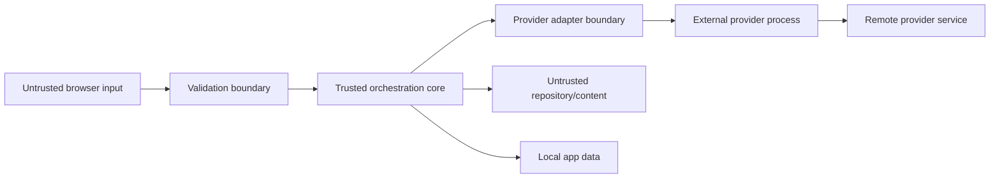

# Security, privacy, and permissions

## Security goals

1. Provider credentials never enter Roundtable-controlled storage or browser memory.
2. Browser input, provider output, chat content, repository content, and skills are all untrusted.
3. No run can access a broader workspace or permission level than the owner selected.
4. A compromised guest/browser session cannot execute arbitrary host commands.
5. The app can explain which process, workspace, permission, and context belonged to any run.

## Trust boundaries



Personal Mode trusts the OS account and loopback network but not arbitrary web pages. Use strict Origin checks and an unguessable per-install browser session token even on localhost to reduce drive-by localhost attacks.

## Threats and controls

| Threat | Required control |
|---|---|
| Malicious page calls localhost server | Loopback bind, Origin allowlist, session token, no permissive CORS |
| Browser sends shell metacharacters | Argument arrays, `shell: false`, server-side enums and paths |
| Prompt injection requests dangerous tools | Permissions enforced outside model text; read-only default |
| Repository symlink escapes root | Resolve real paths at use time and compare against allowed roots |
| Provider output injects HTML | Sanitize Markdown; no raw HTML/scripts |
| Secrets appear in logs | Structured allowlist logging and key-pattern/path redaction |
| Guest consumes owner's subscription | Personal adapter unavailable to guests; policy gate in Phase 7 |
| Two agents overwrite files | Exclusive workspace write lease or isolated worktrees |
| Stale PID termination | Track child identity/token; terminate only owned process tree |
| Database copied | No credentials; clear privacy disclosure; optional encryption later |
| Attachment bomb | Count/size/type limits, streaming hash, no automatic archive extraction |

## Authentication

### Personal Mode

At first start, generate a random local session secret stored in app data with OS-user-only permissions. The browser receives a short-lived HttpOnly, SameSite=Strict cookie through an explicit bootstrap flow. Do not place the secret in query strings or localStorage.

Provider authentication remains entirely external. “Connect Codex/Claude” screens show status and safe instructions or launch the official terminal workflow; they do not collect passwords, OAuth codes, tokens, or API keys.

### Collaboration Mode

Requires a new authentication design: named accounts/invitations, TLS or private network, password/passkey or external identity, revocation, audit, rate limits, and authorization roles. It cannot reuse the Personal Mode bootstrap secret.

## Authorization

Roles envisioned for Collaboration Mode:

- Owner: configure providers/workspaces/permissions and manage data.
- Member: post messages, invoke allowed agents within quota.
- Viewer: read selected rooms only.

Provider invocation, workspace access, skill mutation, export, diagnostics, and permission escalation are separate capabilities. Never infer authorization from prompt text or a mention.

## Permission profiles

Normalized profiles:

```text
chat_only       No workspace access if provider supports it
workspace_read  Read/search validated workspace; default for coding rooms
workspace_write Read/write under workspace with exclusive lease
```

There is no normalized “unrestricted” profile. Provider-specific bypass modes are intentionally unsupported.

When a provider cannot guarantee the requested ceiling in non-interactive mode, the adapter must reject the run rather than silently grant more access.

## Approvals

Phase 5 may introduce approval cards for supported provider events. Each card contains run, agent, requested action, normalized risk, exact affected scope, expiration, and approve/deny controls.

- Approval is single-use and bound to request hash.
- A later/different request needs a new approval.
- Disconnect defaults to deny or waits without auto-approval.
- Approval cannot exceed room/agent/workspace policy.
- The owner can set conservative allow rules for exact tool patterns, but not blanket bypass.

## Workspace validation

1. Accept a path only through owner settings, never arbitrary agent output.
2. Resolve absolute canonical/real path.
3. Reject filesystem roots, home/profile roots, device namespaces, and app-data roots as broad workspaces.
4. Store canonical identity and display alias.
5. Re-resolve referenced paths before access.
6. Ensure relative path remains within root after symlink resolution.
7. Apply OS-specific case sensitivity rules.

## Write lease

A write run requests a transactionally unique active lease. Lease includes run ID, workspace ID, acquired/expiry time, heartbeat, and process token. If server crashes, recovery marks the run interrupted and releases only after confirming the owned child is gone. A lease is authorization, not filesystem isolation; later worktrees add isolation.

## Browser and rendering

- Content Security Policy denies remote scripts and unsafe inline execution.
- Render Markdown with raw HTML disabled or strictly sanitized.
- External links use safe `rel` attributes and never receive local tokens/referrers.
- File links call a validated server endpoint; never construct `file://` links from message text.
- Do not render ANSI escape sequences directly.

## Logging and diagnostics

Logs use an allowlist schema. Prohibited fields include environment dumps, authorization headers, cookies, prompts by default, full file contents, provider tokens, and complete raw stderr.

Diagnostic bundle creation is explicit and previewable. It includes versions, capability matrix, redacted recent errors, migration state, and configuration schema—not transcripts or attachments unless separately selected.

## Privacy

- Telemetry and crash upload are off by default.
- The app clearly states that provider prompts leave the machine through each provider's CLI despite local storage.
- Exports warn that transcripts may contain proprietary code or personal data.
- Encryption-at-rest may be added, but lack of encryption must be disclosed; never market plain SQLite as encrypted.

## Security gates

- No non-loopback binding before Phase 7 threat-model acceptance.
- No workspace write before lease and traversal tests pass.
- No provider adapter release before credential leakage tests pass.
- No guest provider invocation before provider entitlement/policy design is approved.
